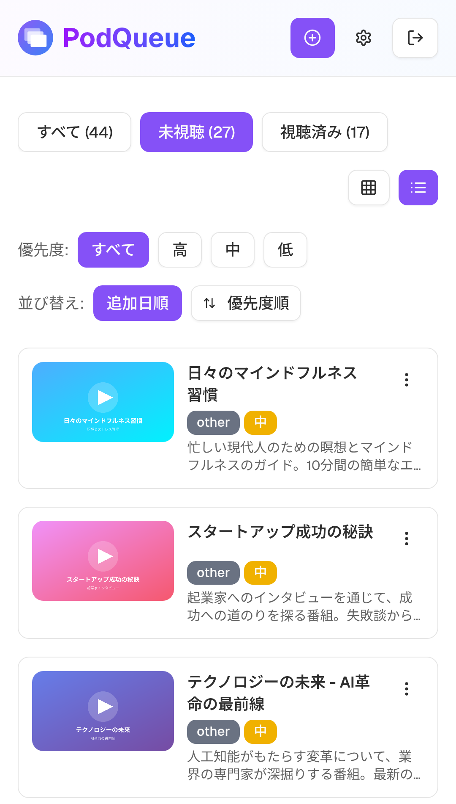
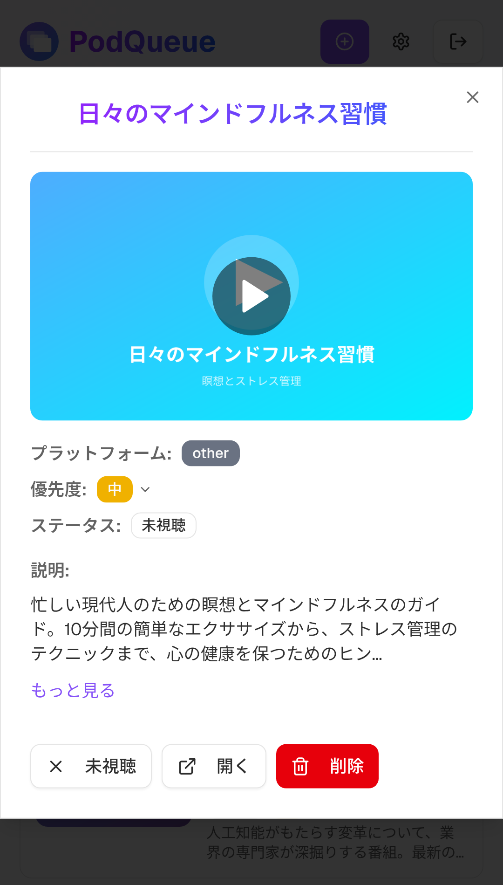
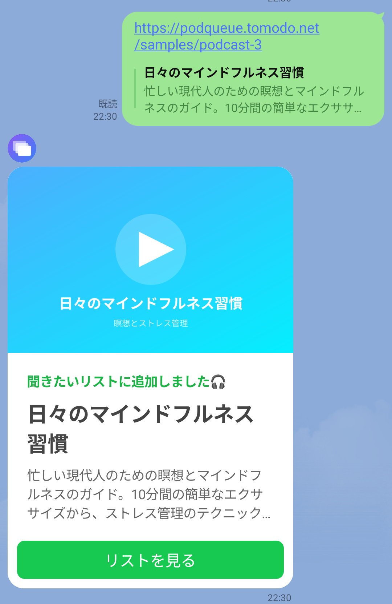

# PodQueue

ポッドキャストをプラットフォーム横断で一元管理する「あとで聴く」Webアプリ

<p align="center">
  <a href="https://github.com/Tomodo1773/podcast-queue"></a>
  <a href="https://github.com/Tomodo1773/podcast-queue"></a>
  <a href="https://github.com/Tomodo1773/podcast-queue/issues"></a>
  <a href="https://github.com/Tomodo1773/podcast-queue/blob/main/LICENSE"></a>
</p>

## 概要

PodQueueは、YouTube、Spotify、NewsPicksなど様々なプラットフォームの動画・音声コンテンツを「あとで聴く」リストとして一箇所で管理できるWebアプリケーションです。

## 使い方イメージ

### 1) URLを集約して「あとで聴く」をキュー化

<p align="center">
  
</p>

YouTube / Spotify / NewsPicks などのURLを同じリストで管理し、優先度や状態でサクッと並び替えできます。

### 2) 詳細画面で内容を確認して、状態を切り替え

<p align="center">
  
</p>

タイトル・説明・サムネイルを自動取得し、未視聴/視聴済み・視聴中や優先度をその場で更新できます。

### 3) LINEにURLを送るだけで登録（あとからまとめて消化）

<p align="center">
  
</p>

移動中にLINEへURLを投げておけば、あとでPodQueueを開いたときに「聴くもの」が揃っています。

## 主な機能

- **URLからメタデータ自動取得** - URLを入力するだけで、タイトル・説明・サムネイルを自動取得（OGP/oEmbed対応）
- **プラットフォーム横断管理** - YouTube、Spotify、NewsPicks、Pivot、テレ東Bizなど複数プラットフォームのコンテンツを一箇所で管理
- **優先度による管理** - 高・中・低の3段階で優先度を設定し、優先度順でソート可能
- **視聴ステータス管理** - 未視聴/視聴済みのステータスを切り替え可能
- **視聴中のピックアップ表示** - 現在視聴中のコンテンツは常にリストの先頭に表示
- **フィルタリング・並び替え** - 視聴状態・優先度でのフィルタリング、追加日順・優先度順での並び替え
- **グリッド/リスト表示切替** - 好みに合わせて表示形式を選択可能
- **LINE連携** - LINEにURLを送信するだけでPodcastを自動登録（設定画面からLINE User IDを連携）

## サンプルポッドキャスト

デモ用のサンプルポッドキャストページを公開しています。OGP対応しており、URLプレビューの動作確認などにご利用いただけます。

- [テクノロジーの未来 - AI革命の最前線](/samples/podcast-1)
- [スタートアップ成功の秘訣](/samples/podcast-2)
- [日々のマインドフルネス習慣](/samples/podcast-3)

## 技術スタック

- **フロントエンド**: Next.js 16 (App Router), React 19, Tailwind CSS 4
- **UI**: shadcn/ui, Radix UI, Lucide Icons
- **バックエンド**: Supabase (認証 + PostgreSQL)

## 開発

```bash
# 開発サーバー起動
pnpm run dev

# ビルド
pnpm run build

# Lint
pnpm run lint

# フォーマット
pnpm run format

# 型チェック
pnpm run typecheck

# 未使用コード検出
pnpm run knip

# チェック（formatting + linting + typecheck + knip）
pnpm run check
```

## ライセンス

[MIT](LICENSE)
